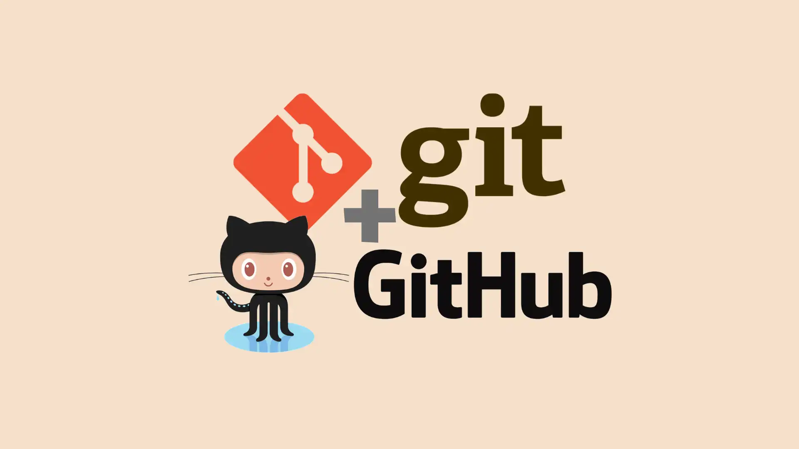

# Atividade 2 – Git e Github

> IFC – Campus Camboriú  
> Prof. Rafael Speroni  
> Discente: Hisllaylla Kézia  
> Matéria: Tópicos Avançados em Programação Web

## Sobre o projeto
Atividade 2 da disciplina com foco na exploração de conceitos básicos e práticos git: criação de repositórios, commits, branches, push, pull e resolução de conflitos. Tudo foi executado via terminal (CLI), simulando um fluxo de trabalho real em desenvolvimento colaborativo.

## Ambiente

- Fedora Linux (versão 42+)
- Git instalado (via repositório oficial)
- Terminal (bash/zsh)
- VSCode

## Pré-requisitos

1. **Git instalado;**  
   Baixe e instale o Git pelo site oficial ou via terminal:  
   [https://git-scm.com](https://git-scm.com)

2. **Conta no GitHub.**  

3. **Terminal.**  
   Use o terminal do sistema ou o Git Bash (no Windows) para executar os comandos.